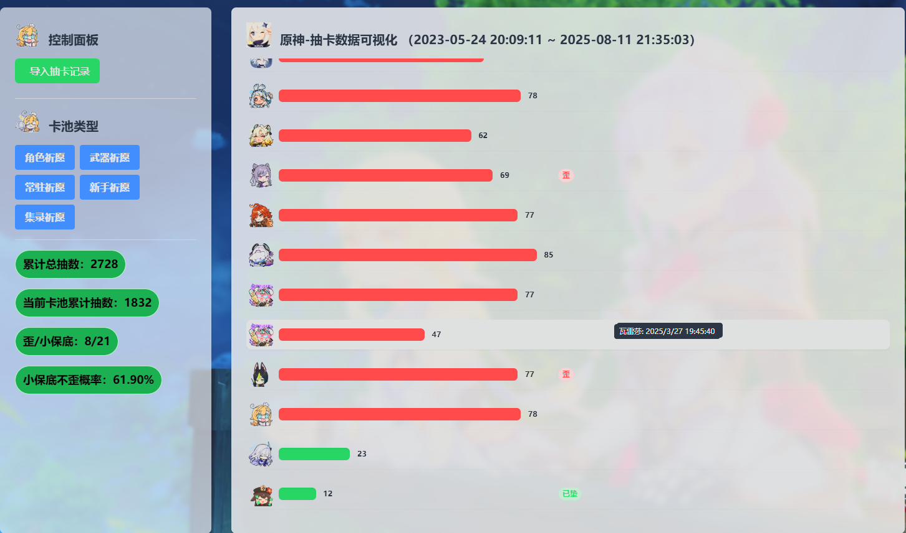

# 功能简介 （学习用品，比较简陋）

1. 导入UIGF配置文件，用于可视化米哈游系列游戏的抽卡数据，仅在windows端启动
2. **本应用不支持获取游戏内数据，和导出数据**
3. 网页可缩放至合适的大小
4. 效果图
5. **如果抽卡数据由Genshin-Wish-Export系列软件导出，可直接导入使用，否则需要检查数据格式**

# UIGF格式支持

1. 先了解定义[UIGF](https://uigf.org/zh/api.html)
2. 支持UIGF3.0 和 UIGF4.0+， 其中3.0版本只测试了原神， 4.0只测试了绝区零和星铁。
3. 对于本应用来说，为开发便利，UIGF格式中，list必须存在额外的2个字段 *name* 和 *rank\_type* ，

有的软件导出的数据没有包含这两个数据，可用开源软件[***Genshin-Wish-Export*** ](https://github.com/biuuu/genshin-wish-export)或其他游戏的同系列软件 导入导出转换一边

# 使用方法

1. 安装python 
2. 双击 ***开始.bat*** 自动启动http服务，并自动打开网页，在移动端打开地址的效果不保证

# 加入新的角色，武器

1. 如果有新常驻，在 ***config/non-special-role.json*** 中按注释说明添加新的常驻角色和常驻武器，之后的步骤为必要的
2. 如果什么都不做，角色头像不会显示，需要添加新角色武器的图片

举例说明：原神加入新角色abc，在 ***media/hk4e/***文件夹中添加图片 ***abc.png***  ,要注意文件名和游戏内角色名必须匹配，添加其他类型武器是一样的

# 其他

1. media目录下为界面图片资源，各部分代表什么可自行研究
2. ***更新uigf配置.bat*** 并没有用到
3. test-data 为自用测试抽卡数据
